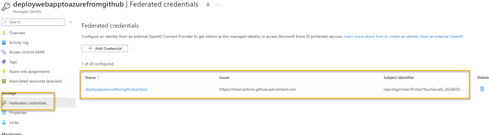
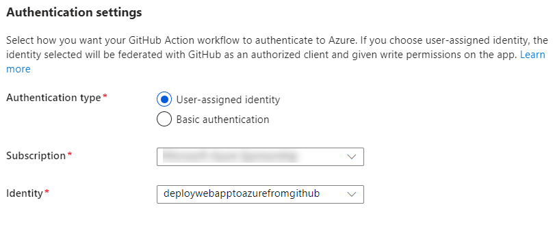

# ACW_DeployAppServiceToAzureViaGitHubActions

This repository is a quick walkthrough on how to set up a user-managed identity with federated credentials to deploy an Azure App service from GitHub Actions

## Prerequisites

- Azure Subscription
- GitHub Account
- Azure CLI
- GIT


>**Note:** this first iteration assumes you already have the repo and the app service created. In the future we'll update to include a sample project and some IAC.

For now, you must have the following in place:

- Azure App Service [nothing deployed, no connection to GitHub set up yet (if you have one, you can disconnect it when we get to that point)]

- GitHub Repository with any deployable project code (it does not matter what tech stack it is, as long as it can be deployed to an Azure App Service and you can see that it works, and your app service is configured correctly to host it).

>**Note:** if you are coming here from the [ACW_ProtectingYourApplicationSecrets](https://github.com/AzureCloudWorkshops/ACW_ProtectingYourApplicationSecrets), you can use the same repository and app service you created in that workshop with the IAC and starter code (or if you don't have a project for now you could start that workshop and come back here when prompted).  Incidentally, I'm creating this workshop because I wanted to use the same app service and repository I created in that workshop for this one, so I'm doing the same thing you would be doing if you are coming from that workshop, or using any other, and you'll see that code in use in images, but the code, once again, is not important for this workshop, just that you have any deployable project in a GitHub repository and an Azure App Service to deploy it to.

## Steps

### Task 1: Create a user-managed identity in Azure  

To begin, you will need to create a user-managed identity in Azure. This identity will be used to authenticate to Azure from GitHub Actions.

>**Note:** you could do these things in other ways (i.e. App Registration - the old way, or via the cli to create resources) but the easiest way with all the credentials and permissions in one place is to use a user-managed identity created in the portal, wired directly to your GitHub repo.  

1. Log in to the azure portal, navigate to Managed Identities, and create a new user-managed identity.  Give it a name that makes sense for the app service you are deploying to, and make sure it is in the same subscription as the app service you are deploying to.

    - Name: `deploywebapptoazurefromgithub` (or whatever makes sense for your app service)
    - Resource Group: `your-resource-group`
    - Subscription: `your-subscription`
    - Region: `your-region`

      

1. Validate that you have the UMI created in the portal.

    

    >**Important:** Make sure to make note of the Client ID of the identity, as this will be used later.  Azure will do it for you, but should you need it, this is where you can find it.  This ClientID in combination with the TenantID and SubscriptionID will be used to validate the federated credentials and authorize from GitHub Actions secrets.

### Task 2: Add the federated credentials to the identity

Once the identity is created, you will need to add the federated credentials to the identity. This will allow the identity to authenticate to Azure from GitHub Actions.  You will explicitly name the path that lets you deploy, such as a branch (like main) or an environment (like production), or you can use a tag if you want. This is a security feature that allows you to control what the identity can do, and where it can do it (so you don't deploy to the wrong environment, for example).  

1. Open the UMI and navigate to the `Fedrated credentials` tab.  Click `Add Credential` to add a new federated credential.

      

1. Select the `GitHub Actions Deploying Azure Resources` option.

      

1. Connect your GitHub account to Azure.  You will need to authorize Azure to access your GitHub account if you have never done this before.

    - Click `Authorize Azure` to connect your GitHub account to Azure (if needed).
    - Select the organization that contains the repository you want to deploy from.
    - Select the repository you want to deploy from.
    - For the entity, choose what makes sense to you. I personally like to use `Environment` and name it `Production`. You could also use a branch like `main` or a tag if you want to be more specific or for some reason the environment option doesn't work for you (note that this is NOT a GitHub environment, it's literally just a string you will map in your action, so you could call it `mydeploymentenvironment` for all GitHub and Federated credentials care, as long as they map exactly).

    

1. Click `Add` to add the federated credential to the identity.  Review the credential is created

      

>**Note:** You could have just let the Azure app service build this for you.  However, I like to have the control over the creation of the identity so I prefer building it first.

### Task 3: Assign the identity to the App Service

With the credential in place, it's time to add to the app service.

1. Navigate to the app service you want to deploy to and click on `Deployment Center` in the left-hand menu.

      

1. Select your repo information to wire up the deployment center to your GitHub repo.

      

    >**Note: the `user-assigned identity` is the new way to deploy with federated credentials and is shown as selected (it's the default for DotNet 8 now) in the image above.

1. Leave `User-assigned identity` selected, then select the UMI you created in the previous task from the dropdown.

    

1. Hit the `Save` button at the top to save the changes.

      

    >**Note:** this will put your secrets into your github repo and trigger a build.  Do not be alrmed if the build fails on the first time.

      

1. Wait for the build. It will likely fail


### Task 4: Update the workflow to use the single stage build on Ubuntu for faster and more reliable builds that don't create extra artifacts which take up your GitHub Actions minutes.  Also, fix broken builds.

If the build worked the first time, congratulations.

Assuming it did not, let's clean up our stuff.

1. First, validate your secrets are in place in GitHub (you won't be able to see the values)..

      

    Make note of all of the three variable names.  You will also be in the github workflow by default. Make sure they are there:

      

    >**Note:** it is highly unlikely azure did not create these with the correct value, but in the off chance that something continues not to work after exhausing other options, you might try updating the values yourself from known values you can get in the portal under your subscription and under the UMI as called out earlier.

1. Modify the yaml to make your life better

    Change the build to use variables and a single-stage deployment on ubuntu.

    - add permissions to use the federated environment and variables for .NET SDK version and the project name, as well as all your secrets:
    
    ```yaml
    permissions:
          id-token: write
          contents: read

    env:
      DOTNET_VERSION: '8.x'
      SECRET_CLIENT_ID: ${{ secrets.AZUREAPPSERVICE_CLIENTID_SOME_GUID }}
      SECRET_TENANT_ID: ${{ secrets.AZUREAPPSERVICE_TENANTID_SOME_GUID }}
      SECRET_SUBSCRIPTION_ID: ${{ secrets.AZUREAPPSERVICE_SUBSCRIPTIONID_SOME_GUID  }}
      APP_NAME: 'your-app-name-here'
    ```

    >**Note:** change the `some_guid` to the actual secret name you see in the secrets in the GitHub repo for each of the three secrets.

    - Change the stage name to `build-and-deploy`
    - Change the `runs-on` to `ubuntu-latest`

    

    >**IMPORTANT: If you using the `Environment` credential and you miss this next step, your build will fail.**  Also note that if you are using the branch you **do not** need to do this step.  This is only for the `Environment` credential.  

    - Make sure to put the environment variable after `runs-on` and before `steps` in the yaml.

    ```yaml
    jobs:
      build-and-deploy:
        runs-on: ubuntu-latest
        environment:
          name: 'Production'
    ```
   
      

    - Change the setup-dotnet to use version 4 (or later if available) and the .NET version variable you set in the env section.  Remove the include prerelease if you don't want to use prerelease versions.

    ```yaml
    - name: Set up .NET Core
        uses: actions/setup-dotnet@v4
        with:
          dotnet-version: ${{ env.DOTNET_VERSION }}
    ```
      

    - Leave everything else the same until the `Upload artifact` task. 

1. Delete the upload artifact step and the download artifact tasks.  You don't need them.  Additionally, remove the second stage `deploy` and just let the steps flow straight from `publish` to `login to azure`.

      

1. Update the login and deploy yaml to use your variables for secrets and app name, and update the package to map to the publish path as above in the yaml:

    ```yaml
    - name: Login to Azure
      uses: azure/login@v1
      with:
        client-id: ${{ env.SECRET_CLIENT_ID }}
        tenant-id: ${{ env.SECRET_TENANT_ID }}
        subscription-id: ${{ env.SECRET_SUBSCRIPTION_ID }}

    - name: Deploy to Azure Web App
      id: deploy-to-webapp
      uses: azure/webapps-deploy@v2
      with:
        app-name: ${{ env.APP_NAME }}
        slot-name: 'Production'
        package: ${{ env.DOTNET_ROOT }}/myapp
    ```  

      


1. Make sure you have a project that builds (mine failed because of not having a working directory set and unable to find the project file to build).  You can see the error in the logs.

      

    ```yaml
    jobs:
      build-and-deploy:
        runs-on: ubuntu-latest
        environment:
          name: 'Production'
        defaults:
          run:
            working-directory: ./MVCProtectingSecrets
    ```  

      

1. Incorrect refs.

    If you fail to set the refs correctly or they don't map, you'll get an error similar to this:

      

    Make sure you have added the correct refs to your build yaml:

    ```yaml
    jobs:
      build-and-deploy:
        runs-on: ubuntu-latest
        environment:
          name: 'Production'
    ```

>**Note:** if you get an error that the "app service resource does not exist" when trying to deploy from GitHub, make sure to assign contributor permissions to the app service for the identity, not just website contributor.  You only need to do this if your build is failing for "resource does not exist".  This problem/issue may eventually go away in the future as the GitHub Actions Azure login process is updated.

1. Update azure login version

    I realized after doing all of the above there was a warning for the login action using an older version of node js.  Therefore you should update to v2 of the login action.  You can do this by changing the login action to the following:

    ```yaml
    - name: Login to Azure
        uses: azure/login@v2
        with:
          client-id: ${{ env.SECRET_CLIENT_ID }}
    ...
    ```  

    

## Conclusion

This walkthrough showed how you can build and deploy an azure app service using GitHub actions, a user managed identity, and federated credentials.  

Please leave comments and feedback if this was useful and/or you find any problems that need clarification or fixes.